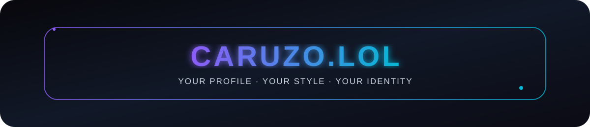

<div align="center">



<a href="https://caruzo.lol">
  
</a>

<br />

<a href="https://caruzo.lol">
  
</a>


</div>

---

## ✦ What is caruzo.lol?

**caruzo.lol** is a customizable profile platform built around individuality, clean design and social presence.

Create your own page, connect your socials, customize the visual style and turn a simple profile into something that feels completely yours.

> **One link. Your profile. Your style.**

---

## ✦ Features

<table>
<tr>
<td width="50%" valign="top">

### 🎨 Custom Profiles
- Personal profile pages
- Custom backgrounds
- Animated backgrounds
- Profile effects
- Cursor effects
- Scroll animations
- Custom color palettes

</td>
<td width="50%" valign="top">

### 🔗 Socials
- Discord integration
- Spotify profile link
- Social links
- Drag & drop ordering
- Clean social cards
- Custom profile identity

</td>
</tr>

<tr>
<td width="50%" valign="top">

### 🎵 Media
- Music support
- Video support
- Controlled default volume
- Click-to-enter experience
- Visual effects matched to the profile

</td>
<td width="50%" valign="top">

### 🛡️ Dashboard
- Discord login
- Live profile preview
- Design controls
- Admin-only customization options
- Badge support
- Persistent profile settings

</td>
</tr>
</table>

---

## ✦ Preview

<div align="center">

```text
caruzo.lol/yourname
```

**Your profile. Your links. Your vibe.**

<a href="https://caruzo.lol">
  
</a>

</div>

---

## ✦ Discord Integration

caruzo.lol is designed to work closely with Discord.

Depending on the connected account and server setup, profiles can display relevant Discord information and supported badges automatically.

```text
Discord Account
      │
      ▼
 caruzo.lol
      │
      ├── Profile
      ├── Badges
      ├── Socials
      └── Custom Design
```

---

## ✦ Profile Customization

Your profile can be customized directly from the dashboard.

```diff
+ Animated backgrounds
+ Scroll effects
+ Profile effects
+ Cursor effects
+ Social ordering
+ Music / video
+ Custom colors
+ Live preview
```

The goal is simple: **give every profile its own identity without making the editor complicated.**

---

## ✦ Design Philosophy

<div align="center">

### Clean · Modern · Animated · Personal

</div>

caruzo.lol focuses on a dark, modern interface with subtle animations, smooth transitions and enough customization to make every page unique.

---

## ✦ Roadmap

- [x] Custom profile pages
- [x] Discord login
- [x] Social links
- [x] Music / video
- [x] Profile customization
- [x] Live preview
- [x] Animated visual effects
- [ ] More profile themes
- [ ] More badges
- [ ] More integrations
- [ ] More customization options

---

## ✦ Links

<div align="center">

<a href="https://caruzo.lol">
  
</a>

<br /><br />

Made for **caruzo.lol**


</div>
