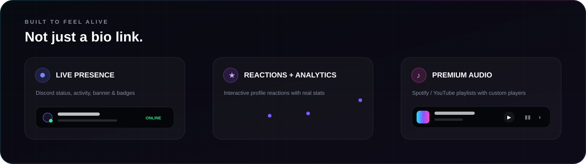
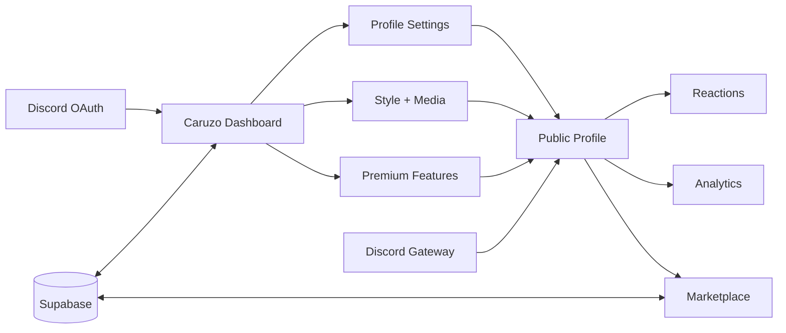

<div align="center">



<br/>

<a href="https://caruzo.lol"></a>


<br/><br/>

**Caruzo ist eine Discord-native Personal-Profile-Plattform mit Live Presence, anpassbaren Profilen, Marketplace, Reactions, Premium Music Player und Analytics.**

[🌐 Live öffnen](https://caruzo.lol) · [✨ Features](#-features) · [🚀 Lokal starten](#-lokal-starten) · [⚙️ Konfiguration](#️-konfiguration) · [🛡️ Sicherheit](#️-sicherheit)

</div>

---

## ✦ Was ist Caruzo?

Caruzo verwandelt ein klassisches Bio-Link-Profil in eine **interaktive, animierte persönliche Seite**. Nutzer verbinden Discord, bauen ihr Profil im Dashboard, passen Design und Medien an und veröffentlichen es direkt unter:

```text
https://caruzo.lol/<username>
```

Dabei geht es nicht nur um Links: Caruzo kombiniert **Discord Presence, Profil-Design, Musik, Reactions, Marketplace-Presets, Premium Sections und Statistik** in einer einzigen Oberfläche.



---

## ✨ Features

<table>
<tr>
<td width="33%" valign="top">

### 🟣 Discord Native
- Discord OAuth Login
- Avatar & Banner Sync
- Avatar Decorations
- öffentliche Badges
- Server Booster Badge
- Live Status & Aktivität
- Discord Gateway + Fallback

</td>
<td width="33%" valign="top">

### 🎨 Profile Studio
- Live Preview
- animierte Hintergründe
- Cursor & Hover Effects
- Style Presets
- Discord Banner Size
- Highlights
- Privacy Controls
- Entrance Animations

</td>
<td width="33%" valign="top">

### 🔥 Reactions
- eigene Emojis
- eigene Labels
- Drag & Drop
- mehrere Positionen
- 8 Klick-Animationen
- öffentliche Counter optional
- Reaction Analytics

</td>
</tr>
<tr>
<td width="33%" valign="top">

### 🎵 Premium Music
- Spotify & YouTube
- Playlists
- mehrere Player-Designs
- Cover / Skip / Progress
- eigene Farben
- frei positionierbar
- Video-Sound wird automatisch gemutet

</td>
<td width="33%" valign="top">

### 🛍️ Preset Marketplace
- Public & Private Presets
- Style übernehmen
- Presets speichern
- Background-/Media-Preview
- Profilbild des Creators
- Public Presets werden bereinigt

</td>
<td width="33%" valign="top">

### 📊 Premium Analytics
- Views
- Reactions
- Social Clicks
- Engagement Rate
- Music Plays / Skips
- Traffic Sources
- Geräteklassen
- 7D / 30D / 90D / 1Y

</td>
</tr>
<tr>
<td width="33%" valign="top">

### 💎 Premium Sections
- Text Sections
- Tabs
- Info Fields
- Gallery
- 4er Bild-Grid
- Drag & Drop Bilder
- Section Live Preview

</td>
<td width="33%" valign="top">

### 🧰 Admin & Moderator
- Invite Keys
- User Suche
- Ban / Unban
- Premium Rollen
- Moderator Rollen
- Changelog Management
- FAQ Management
- globale Design Settings

</td>
<td width="33%" valign="top">

### 🌌 Landing Experience
- animierte WebGL Hintergründe
- Scroll Reveal Presets
- Custom Cursor
- Live Profile Preview
- animierte FAQ Cards
- Changelog
- Login- & 404-Designs

</td>
</tr>
</table>

---

## 🎛️ Dashboard

Das Dashboard ist der zentrale Editor von Caruzo. Änderungen werden live dargestellt und können gesammelt gespeichert werden.

**Public**
`View Profile` · `Marketplace` · `Statistics`

**Profile**
`Profile` · `Views` · `Badges` · `Labels` · `Metadata` · `Entrance` · `Highlights` · `Privacy` · `Reaction`

**Content**
`Presence` · `Spotify` · `Music` · `Socials` · `Premium` · `Discord`

**Style**
`Appearance` · `Presets` · `Background` · `Placement` · `Effects`

> [!TIP]
> Admin- und Moderator-Funktionen liegen bewusst im Account-Menü und werden normalen Nutzern gar nicht angezeigt.

---

## 🧠 So arbeitet Caruzo



---

## 🚀 Lokal starten

### 1. Repository vorbereiten

```bash
git clone <DEIN-REPOSITORY>
cd caruzo
npm install
```

### 2. Environment anlegen

Kopiere `.env.example` zu `.env`:

```bash
cp .env.example .env
```

### 3. Discord App konfigurieren

Im [Discord Developer Portal](https://discord.com/developers/applications):

1. Application erstellen
2. OAuth2 Redirect hinzufügen:

```text
http://localhost:3000/auth/callback
```

3. Für Live Presence beim Bot **Presence Intent** aktivieren
4. Bot auf mindestens einen gemeinsamen Server mit den Profil-Nutzern einladen

### 4. Starten

```bash
npm start
```

Danach:

```text
http://localhost:3000
```

---

## ⚙️ Konfiguration

Die wichtigsten Variablen:

```env
DISCORD_CLIENT_ID=
DISCORD_CLIENT_SECRET=
DISCORD_BOT_TOKEN=

BASE_URL=http://localhost:3000
SESSION_SECRET=replace-with-a-long-random-secret
PORT=3000

SITE_PASSWORD=replace-with-owner-password
ADMIN_DISCORD_IDS=your_discord_id

SUPABASE_URL=
SUPABASE_SERVICE_ROLE_KEY=
SUPABASE_BUCKET=caruzo-uploads

# optional
DISCORD_BOOST_GUILD_ID=
SPOTIFY_CLIENT_ID=
SPOTIFY_CLIENT_SECRET=
SPOTIFY_REDIRECT_URI=
```

> [!IMPORTANT]
> `.env` niemals committen. Besonders `SESSION_SECRET`, `SITE_PASSWORD`, Bot Tokens und `SUPABASE_SERVICE_ROLE_KEY` gehören ausschließlich in sichere Environment Variables.

---

## 🗃️ Persistenz

Caruzo unterstützt zwei Wege:

| Modus | Profile | Uploads | Geeignet für |
|---|---:|---:|---|
| **Supabase** | ✅ | ✅ | Render Free / Produktion |
| **Lokales Filesystem** | ✅ | ✅ | lokale Entwicklung |
| **Persistent Disk** | ✅ | ✅ | bezahltes Hosting / eigener Server |

Für Render Free wird **Supabase empfohlen**, weil das lokale Dateisystem bei Deploys nicht dauerhaft ist.

Weitere Details stehen in [`FREE_PERSISTENCE_GUIDE.md`](FREE_PERSISTENCE_GUIDE.md).

---

## 🔐 Rollen & Zugriff

| Rolle | Profil bearbeiten | Marketplace | Premium Features | Invite Keys | FAQ lesen | FAQ ändern | User Moderation |
|---|:---:|:---:|:---:|:---:|:---:|:---:|:---:|
| User | ✅ | ✅ | wenn freigeschaltet | — | — | — | — |
| Moderator | ✅ | ✅ | wenn freigeschaltet | ✅ | ✅ | — | eingeschränkt |
| Admin | ✅ | ✅ | ✅ | ✅ | ✅ | ✅ | ✅ |

---

## 💎 Premium

Premium ist mehr als ein Badge. Aktuell umfasst es unter anderem:

- **Premium Playlist Player** mit Spotify / YouTube
- mehrere Music-Player-Designs
- eigene Player-Farben und Positionen
- **Premium Statistics** mit professionellen Graphen
- Text- und Gallery-Sections
- Section Tabs & Info Fields
- zusätzliche Individualisierung im Profil

Free-User sehen Premium Analytics als **geblurred Preview mit zentralem Premium-Hinweis**; die API ist zusätzlich serverseitig geschützt.

---

## 🔥 Reaction System

Besucher können direkt auf ein Profil reagieren. Der Profilbesitzer entscheidet selbst:

- welche Emojis sichtbar sind
- wie sie heißen
- wo sie erscheinen
- welche Animation ausgelöst wird
- ob Counter öffentlich sichtbar sind

Die dazugehörigen Analytics zeigen Entwicklung, Verteilung und Reaction/View-Rate im Dashboard.

---

## 🛍️ Marketplace & Privacy

Caruzo trennt bewusst zwischen **Private** und **Public Presets**.

### Private
Private Presets gehören nur dem jeweiligen Nutzer und dürfen dessen editierbare Profilkonfiguration enthalten.

### Public
Public Presets werden serverseitig bereinigt. Persönliche Account-Daten, OAuth-Tokens, Discord-Interna, Admin-Daten und andere sensible Informationen werden nicht veröffentlicht.

Damit bleibt der Marketplace bequem, ohne persönliche Account-Konfiguration unnötig offenzulegen.

---

## 🛡️ Sicherheit

Caruzo trennt öffentliche Profilinformationen von internen Account- und Session-Daten.

- OAuth- und Session-Secrets bleiben serverseitig
- Admin-Zugriff wird serverseitig geprüft
- Premium Statistics sind serverseitig gesperrt
- Public Marketplace Presets werden bereinigt
- Uploads werden validiert
- gebannte Accounts erhalten eine eigene Sperrseite
- sensible Environment Variables gehören nicht ins Repository

> [!WARNING]
> Ein öffentliches Repository sollte **niemals echte Tokens, Service-Role-Keys, Discord Secrets oder Owner-Passwörter** enthalten.

---

## 🧩 Tech Stack

<p>


</p>

```text
Node.js / Express
├── Discord OAuth
├── Discord Gateway WebSocket
├── Profile API
├── Marketplace API
├── Reaction + Analytics API
├── Admin / Moderator API
├── Supabase Persistence
└── Static Dashboard / Landing / Profile UI
```

---

## 📁 Projektstruktur

```text
caruzo/
├── public/
│   ├── landing.html
│   ├── dashboard.html
│   ├── profile.html
│   ├── banned.html
│   ├── 404.html
│   ├── site-bg.js
│   └── ...
├── server.js
├── package.json
├── .env.example
├── FREE_PERSISTENCE_GUIDE.md
└── README.md
```

---

## 🆕 Aktuelle Highlights

<details open>
<summary><b>V34 · FAQ, Changelog & Discord Banner Control</b></summary>
<br/>

- Discord-Banner-Höhe pro Profil einstellbar
- FAQ Management direkt im Admin Panel
- Moderatoren können FAQ lesen, aber nicht bearbeiten
- farbigere, animierte FAQ auf der Landingpage
- Changelog-Einträge nachträglich editierbar
- keine automatische Changelog-Vorlage mehr

</details>

<details>
<summary><b>V33 · Premium Statistics Lock</b></summary>
<br/>

- Statistics als echtes Premium Feature
- Free-Ansicht geblurrt
- zentrale Premium-Meldung
- Controls deaktiviert
- `/api/statistics` zusätzlich serverseitig geschützt

</details>

<details>
<summary><b>V31 · Premium Music + Statistics</b></summary>
<br/>

- Spotify / YouTube Playlist Player
- mehrere Player-Designs
- eigene Farben & Position
- Skip / Progress / Cover
- professionelle Profile Analytics

</details>

<details>
<summary><b>V30 · Reactions</b></summary>
<br/>

- eigene Emojis
- Drag & Drop
- mehrere Positionen
- 8 Reaction-Animationen
- Reaction Analytics

</details>

<details>
<summary><b>V23+ · Marketplace</b></summary>
<br/>

- Public / Private Presets
- Style Sharing
- Creator Preview
- Medien- und Background-Vorschau
- serverseitige Bereinigung öffentlicher Presets

</details>

---

## 🤝 Entwicklung

Caruzo wird als eigenständige Personal-Profile-Plattform kontinuierlich erweitert. Bei Änderungen sollten besonders diese Bereiche getestet werden:

- Discord Login / Session
- öffentliche Profile
- Mobile Layout
- Premium Locks
- Marketplace Privacy
- Uploads
- Admin / Moderator Rechte
- Discord Presence
- Spotify / YouTube Player

Vor einem Deploy:

```bash
node --check server.js
npm install
npm start
```

---

<div align="center">


<br/>

### **Your profile. Your atmosphere.**

<sub>Built for <a href="https://caruzo.lol">caruzo.lol</a></sub>

</div>
